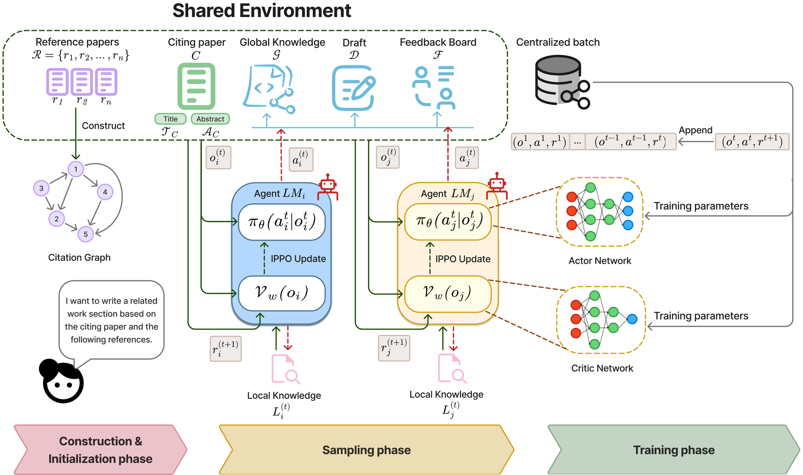
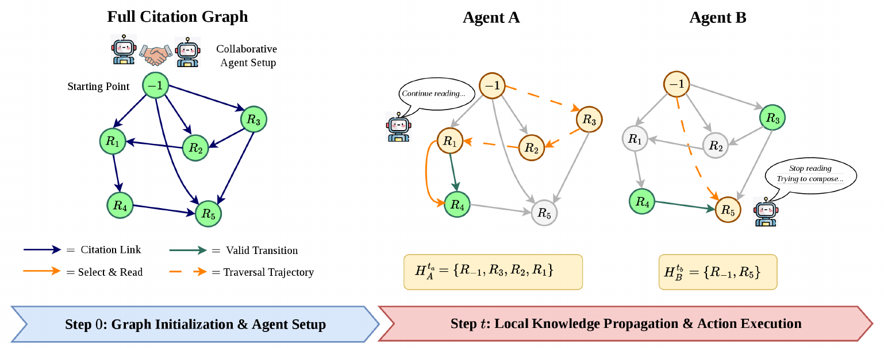
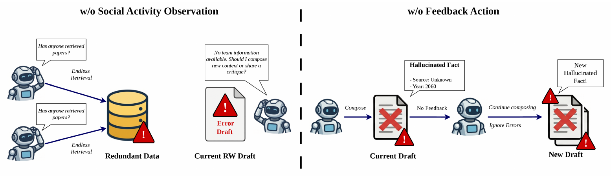
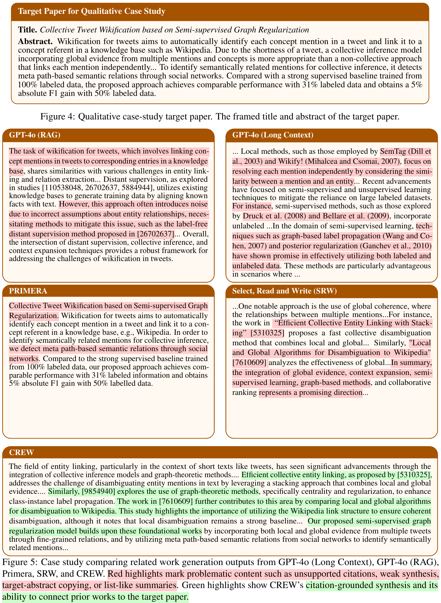

# [EMNLP 2026] CREW: <ins>C</ins>ollaborative <ins>R</ins>einforcement Learning for R<ins>e</ins>lated <ins>W</ins>ork Generation

<div align="center">

[](https://python.org)
[](https://pytorch.org)
[](https://arxiv.org/abs/2405.01930)
[](LICENSE)

*A collaborative multi-agent reinforcement learning framework where LLM agents bypass heuristic pipelines and dynamically coordinate to write the Related Work section.*

</div>

---

## 🔍 1. Overview

**CREW** casts Related Work Generation (RWG) as a **Dec-POMDP** and trains LLM agents to *choose their own actions* instead of following a hand-designed pipeline. At every timestep each agent observes a compact view of the shared workspace and independently picks one of four actions — **Retrieve**, **Disseminate**, **Compose**, or **Critique** — under a shared policy optimized with **IPPO** (parameter sharing).

<div align="center">

</div>

### Key Features

- 🤝 **Two collaborative actions**: `Disseminate` shares private findings into a global knowledge base; `Critique` produces structured feedback that later drafts must address.
- 🧠 **Learned coordination, no orchestrator**: agents act in parallel from local observations — no token-hungry central coordinator.
- 📐 **Compact 20-D observation**: 4 documents × 5 features (relevance, coverage/novelty, personal action distribution, token capacity, social activity), independent of team size `M`.
- 🎯 **Delta-based cooperative reward**: `r = (1 − λᵗ)·ΔQ_D + λᵗ·ΔQ_k`, shifting attention from background documents toward the final draft over time.
- 🔁 **Transferable policy**: a controller trained with Qwen 2.5 72B works unchanged with LLaMA 8B, Gemini 2.0 Flash and GPT-4o.
- 📎 **Citation grounding**: 99.33% citation verification vs. 80.40% for the SRW baseline.

---

## 🧩 2. Framework

### 2.1 Actions

Agents traverse a citation graph built from the target paper (sentinel ID `−1`) and its references.

<div align="center">

</div>

| Paper action | Code name (`AgentAction`) | Effect |
|:---|:---|:---|
| **Retrieve** | `SEARCH` (0) | Selects and reads one unread paper section; updates the agent's **private** local knowledge `Lᵢ`. |
| **Disseminate** | `UPDATE` (1) | Merges local knowledge into the **shared** global knowledge `G`. |
| **Compose** | `WRITE` (2) | Revises the draft `D` from `G`, `Lᵢ` and pending feedback. |
| **Critique** | `FEEDBACK` (3) | Reviews the draft and appends structured suggestions to the feedback board `F`. |

> [!NOTE]
> The paper uses the names Retrieve/Disseminate/Compose/Critique; the source code uses the original SEARCH/UPDATE/WRITE/FEEDBACK identifiers. They are the same four actions.

### 2.2 Shared State

| Component | Symbol | Visibility |
|:---|:---:|:---|
| Local knowledge | `Lᵢ` | Private to agent *i* |
| Global knowledge | `G` | Shared |
| Draft | `D` | Shared |
| Feedback board | `F` | Shared |

When several agents edit a shared document in the same step, each reports a confidence score and the environment merges edits segment-by-segment; ties go to the highest confidence.

---

## 🚀 3. Quick Start

### Step 1. Install

```bash
conda create -n RWG python=3.12 -y
conda activate RWG
pip install -r requirements.txt
```

### Step 2. Set Up Environment Variables

Copy the template and fill in only the providers you actually use:

```bash
cp .env.example .env
```

```ini
OPENROUTER_API_KEY=sk-or-v1-xxxxxxxx   # main backend (Qwen 2.5 72B)
OPENAI_API_KEY=                        # optional - GPT-4o baselines / judge
GOOGLE_API_KEY=                        # optional - Gemini
ANTHROPIC_API_KEY=                     # optional - Claude

VLLM_BASE_URL=http://localhost:8000/v1 # optional - local serving
RWG_DATA_DIR=data2                     # dataset directory
RWG_PAPERS_FILE=OARelatedWork_full.jsonl
```

Get an OpenRouter key at <https://openrouter.ai/keys>. Models are addressed with a `provider:model` prefix — `openrouter:`, `openai:`, `gemini:`, `claude:`, `vllm:`.

### Step 3. Prepare the Dataset

CREW runs on [OARelatedWork](https://arxiv.org/abs/2405.01930). Place the files under `RWG_DATA_DIR` (default `data2/`):

```text
data2/
├── OARelatedWork_full.jsonl   # id, title, abstract, related_work, referenced
├── citation_adj_out.json      # {paper_id: [cited ids]}
└── citation_adj_in.json       # {paper_id: [citing ids]}
```

> [!IMPORTANT]
> The dataset (~560 MB) and trained checkpoints are **not** stored in this repository — they are git-ignored. Point `RWG_DATA_DIR` at wherever you keep them.

### Step 4. Train the Policy

```bash
python src/train_self_supervised.py -a 3 -e 3 -s 15 --limit 30 --cold-start --scratch --no-wandb
```

| Flag | Default | Meaning |
|:---|:---:|:---|
| `-a` | `3` | Number of agents `M` |
| `-e` | `3` | Training epochs |
| `-s` | `15` | Timesteps (rounds) per paper |
| `--limit` | all | Cap on training papers |
| `--cold-start` | off | Heuristic warm-up: SEARCH → UPDATE → FEEDBACK → WRITE |
| `--scratch` | off | Ignore existing checkpoints, start from random weights |
| `--best` / `--ckpt PATH` | — | Resume from best / from a specific checkpoint |
| `--paper-save-freq` | `6` | Save a checkpoint every *N* papers |
| `--model` | `openrouter:qwen/qwen-2.5-72b-instruct` | Override the inference LLM |
| `--min-neighbors` | `5` | Minimum valid citation neighbors per target |
| `--no-wandb` | off | Disable WandB logging |

Checkpoints land in `checkpoints/self_supervised/<timestamp>/{paper_N,epoch_N,latest}/`.

> On Windows, set `$env:PYTHONUNBUFFERED = 1` and `$env:PYTHONUTF8 = 1` before training so logs stream correctly.

### Step 5. Generate a Related Work Section

```bash
python src/inference.py --list-tasks                       # wsn | nlp | rl
python src/inference.py --task nlp -a 4 -s 15 --best --no-heuristic
python src/inference.py --title "Your title" --abstract "Your abstract..."                         -a 4 --ckpt checkpoints/self_supervised/<run>/latest --no-heuristic
```

| Flag | Meaning |
|:---|:---|
| `--task` | One of the built-in targets in `src/core/tasks.py`. Ignored when both `--title` and `--abstract` are given; with neither, a default WRSN paper is used. |
| `--no-heuristic` | **Select actions with the trained actor.** The default `--heuristic` uses a fixed availability-based rule and ignores the checkpoint. |
| `--cold-start` | Warm-up sequence SEARCH, SEARCH, UPDATE, WRITE, FEEDBACK before the policy takes over — useful for short runs that would otherwise never reach a WRITE. |
| `--scratch` | Random policy, no checkpoint. |
| `--fixed-seq` | Force SEARCH → UPDATE → FEEDBACK → WRITE. |

Each run writes per-step artifacts to `--output` (default `./outputs`): `draft_step*.txt`, `feedback_step*.txt`, `global_step*.txt`, `local_<agent>_step*.txt`, plus a final `related_work_<timestamp>.md`.

### Step 6. Evaluate

Evaluation reads the 30 target papers in `target_papers_metadata.json` (shipped with this repo — `id`, `title`, `abstract`, gold `related_work`, `referenced`).

```bash
python src/evaluation/run_and_eval_full.py --limit 5
python src/evaluation/run_and_eval_full.py --target_id 561894
python src/evaluation/run_and_eval_full.py --ckpt checkpoints/self_supervised/<run>/latest --overwrite
```

This runs CREW at 1/2/3/4 agents alongside the GPT-4o RAG and long-context baselines, then scores every draft with the LLM-as-a-Judge protocol. Results:

```text
result/
├── drafts/            # P<id>_<scenario>.txt
├── logs/
├── execution_log.txt
└── final_scores.csv   # Coverage, Logic, Relevance, Citation Verification, tokens
```

### (Optional) Serve a Model Locally

```bash
python src/serve.py --list                  # available models
python src/serve.py --gpu-info              # detected GPUs
python src/serve.py --model qwen2.5-72b     # start vLLM on VLLM_BASE_URL
python src/serve.py --model qwen2.5-7b --dry-run
```

Then train or evaluate with `--model vllm:<model-id>`. Requires `pip install vllm`.

---


Datasets, checkpoints, generated drafts, logs and WandB runs are intentionally git-ignored — see `.gitignore` before adding files.

---

## 📊 4. Experimental Results

All numbers below are taken from the paper. Quality scores are the mean of three judges (GPT-4o, LLaMA 3.3 70B, DeepSeek-V3) on a 1–5 Likert scale; **Ver.** is citation verification, the share of generated citations that exist in the reference pool.

### 4.1 Main Results (OARelatedWork)

| Model | Cov. ↑ | Logic ↑ | Rel. ↑ | Overall ↑ | Ver.(%) ↑ | Tokens ↓ |
|:---|:---:|:---:|:---:|:---:|:---:|:---:|
| PRIMERA | 1.18 | 1.41 | 2.04 | 1.54 | 0.00 | **0.34K** |
| GPT-4o (Long Context) | 3.20 | 3.28 | 3.76 | 3.41 | 48.61 | 6.61K |
| GPT-4o (RAG) | 3.19 | 3.30 | 3.76 | 3.42 | 96.40 | 3.68K |
| Select, Read, and Write (Qwen 2.5 72B) | 3.38 | **3.73** | 4.17 | 3.76 | 80.40 | 210.37K |
| Orchestrator (Qwen 2.5 72B) | 3.41 | 3.71 | **4.27** | 3.80 | **99.67** | 181.29K |
| **CREW (Qwen 2.5 72B, 4 Agents)** | **3.44** | **3.73** | **4.27** | **3.82** | 99.33 | 198.74K |

Against SRW, CREW gains **+0.06** overall, **+23.54%** citation verification, and uses **5.53% fewer tokens**.

### 4.2 Policy Transferability

The controller is trained once with Qwen 2.5 72B, then reused unchanged with other inference backbones.

| Inference Model | Cov. ↑ | Logic ↑ | Rel. ↑ | Overall ↑ | Ver.(%) ↑ | Tokens ↓ |
|:---|:---:|:---:|:---:|:---:|:---:|:---:|
| LLaMA 8B (Long-context) | 2.97 | 2.99 | 3.17 | 3.04 | 53.23 | 20.52K |
| **LLaMA 8B + CREW** | 3.31 | 3.42 | 3.96 | 3.57 | 82.01 | 161.49K |
| Gemini 2.0 Flash (Long-context) | 3.11 | 3.17 | 3.54 | 3.28 | 98.61 | 20.93K |
| **Gemini 2.0 Flash + CREW** | 3.31 | 3.60 | 4.23 | 3.71 | 96.70 | 156.10K |
| Qwen 2.5 72B (Long-context) | 3.19 | 3.35 | 3.73 | 3.42 | 65.83 | 21.57K |
| **Qwen 2.5 72B + CREW** | 3.31 | 3.33 | 4.17 | 3.79 | 96.20 | 121.81K |
| GPT-4o (Long Context) | 3.20 | 3.28 | 3.76 | 3.42 | 48.61 | 6.61K |
| **GPT-4o + CREW** | 3.43 | 3.77 | 4.26 | 3.82 | 96.70 | 139.10K |

Every backbone improves over its own long-context setting, so the learned coordination protocol is not tied to a single model.

### 4.3 Ablation Study

| Configuration | Cov. ↑ | Logic ↑ | Rel. ↑ | Overall ↑ | Ver.(%) ↑ | Tokens ↓ |
|:---|:---:|:---:|:---:|:---:|:---:|:---:|
| w/o Draft Quality Reward | 3.50 | 3.70 | 4.30 | 3.83 | 44.07 | 139.02K |
| w/o Feedback Action | 2.33 | 2.54 | 2.85 | 2.58 | 10.00 | 37.54K |
| w/o Social Activity Observation | 2.97 | 3.30 | 3.65 | 3.30 | 0.00 | 85.57K |
| **CREW (Full System)** | 3.44 | 3.73 | 4.27 | 3.82 | **99.33** | 198.74K |

<div align="center">

</div>

- **w/o Draft Quality Reward** — the overall score edges up (+0.01) but citation verification collapses to 44.07%: retrieved evidence stops being grounded in the draft.
- **w/o Feedback Action** — the largest drop (2.58 overall). Without `Critique`, agents have no mechanism to flag hallucinated citations introduced by peers.
- **w/o Social Activity Observation** — agents cannot see what others are doing, causing endless redundant retrieval and 0% valid citations.

### 4.4 Scaling the Number of Agents

| Agents | Cov. ↑ | Logic ↑ | Rel. ↑ | Overall ↑ | Ver.(%) ↑ | Tokens ↓ | Time(s) ↓ |
|:---:|:---:|:---:|:---:|:---:|:---:|:---:|:---:|
| 1 | 3.04 | 3.36 | 3.82 | 3.41 | 86.10 | **42.26K** | **359** |
| 2 | 3.41 | 3.69 | 4.27 | 3.79 | **100.00** | 90.64K | 778 |
| 3 | 3.31 | 3.33 | 4.17 | 3.79 | 96.20 | 121.81K | 644 |
| 4 | 3.44 | 3.73 | 4.27 | 3.82 | 99.33 | 198.74K | 755 |
| 5 | **3.48** | **3.77** | **4.36** | **3.87** | 99.17 | 246.49K | 833 |

Quality rises with team size while wall-clock time grows only mildly — agents act in parallel, so each timestep costs the `max` rather than the `sum` of agent latencies.

### 4.5 Qualitative Comparison

<div align="center">

</div>

---

## 🔧 5. Configuration

### 5.1 Hyperparameters

| Category | Notation | Description | Value |
|:---|:---:|:---|:---:|
| **RL** | `α_ω` | Actor learning rate | 3 × 10⁻⁴ |
| | `α_φ` | Critic learning rate | 1 × 10⁻³ |
| | `γ` | Discount factor | 0.99 |
| | `λ` | GAE parameter | 0.95 |
| | `ε` | Clipping threshold | 0.2 |
| | `K` | PPO epochs | 4 |
| | `c_e` | Entropy coefficient | 0.01 |
| | `T` | Rollout steps (rounds per paper) | 15 |
| **LLM** | `τ` | Temperature | 0.3 |
| | `p` | Top-*p* sampling | 0.9 |
| | `N_max` | Max output tokens | 1400 |
| **Reward** | `γ_D,1` / `γ_D,2` | Draft quality coefficients | 0.8 / 0.2 |
| | `γ_L,1` / `γ_L,2` / `γ_L,3` | Local quality coefficients | 0.5 / 0.3 / 0.2 |
| | `γ_G,1` / `γ_G,2` / `γ_G,3` | Global quality coefficients | 0.5 / 0.3 / 0.2 |
| **Network** | — | Shared Actor: 20 → 32 → 32 → 4 | 672 / 1056 / 132 params |
| | — | Shared Critic: 20 → 32 → 32 → 1 | 672 / 1056 / 33 params |

RL and network values live in `src/train_self_supervised.py`; LLM decoding defaults are in `src/core/config.py`.

### 5.2 Model Aliases

`src/core/config.py` defines shortcuts you can pass to `--model`:

| Alias | Resolves to |
|:---|:---|
| `qwen72b-or` | `qwen/qwen-2.5-72b-instruct` (OpenRouter) |
| `qwen72b` | `qwen/qwen2.5-72b-instruct` (Novita) |
| `qwen` | `vllm:Qwen/Qwen3-30B-A3B-Instruct-2507` (local) |
| `gpt` | `openai:gpt-4o-mini` |
| `2` | `gemini:gemini-2.0-flash` |
| `3` | `claude:claude-3-5-haiku-latest` |

### 5.3 Reproduction Notes

- Experiments used **2%** of OARelatedWork for training and a disjoint **0.4%** for evaluation; target papers need at least 5 valid citation neighbors (`--min-neighbors 5`).
- Actor/critic training runs on a single NVIDIA RTX A5000 (24 GB); all LLM calls go through the OpenRouter API.
- Because generation depends on LLM sampling, run-to-run variance is expected — the reported scores are averages over three judges.

---

## 📚 6. Citation

If you find CREW useful in your research, please consider citing our paper:

```bibtex
@inproceedings{crew2026,
  title     = {Assembling the CREW: A Collaborative Multi-agent Reinforcement Learning
               Framework for Automated Related Work Generation},
  author    = {Dang Hai Dang, Pham Bao Yen, Bao Nguyen, Tran Thi Huong, Huynh Thi Thanh Binh},
  booktitle = {Proceedings of the 2026 Conference on Empirical Methods in Natural Language Processing (EMNLP)},
  year      = {2026}
}
```

---

<div align="center">

Made with ❤️ for the scientific writing research community!

</div>
